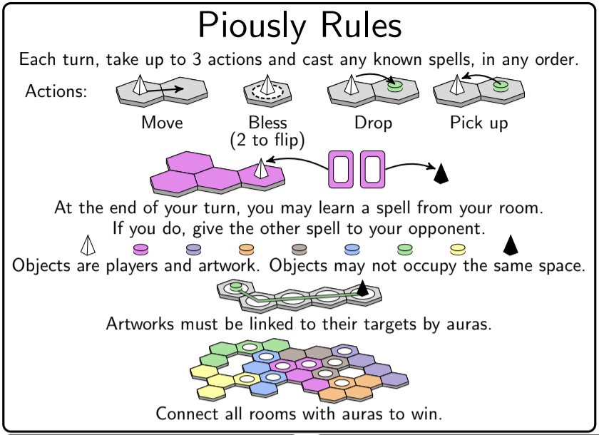
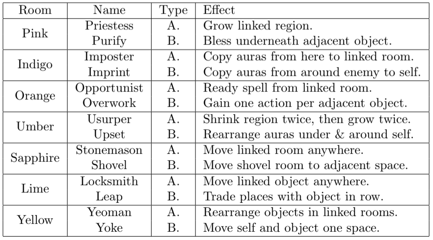

# piously
A web implementation of Piously, by Jonah Ostroff.

## Game Details

### Overview
You are the high priests of Light and Darkness, and your patron deities have been at war for ages. The fate of their struggle rests with the seven goddesses. You’ve come to the Temple of the Seven to seek their gifts and exert your influence, but beware: the Seven do not take sides prematurely. Whenever you ask one for a blessing, she will give another gift to your enemy. Wield these gifts carefully to gain control of the temple.

Piously is a two-player game of area control and tactical combos. You’ll be fighting to place auras on the board and convert enemy auras to your own. If you form a connected region of auras that touches all seven rooms of the temple, you win!

### Rules Quick-Reference

### Full Rules
For the full rules, just ask for the PDF.